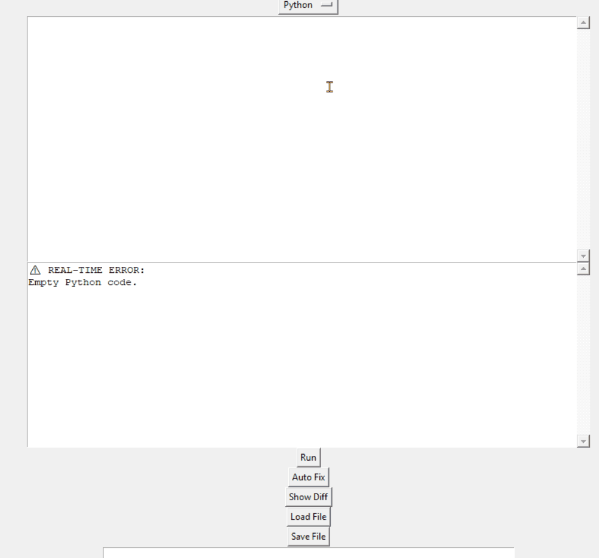
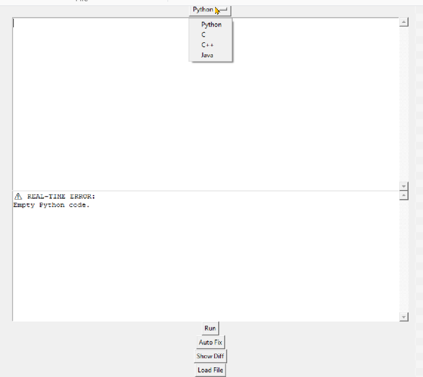
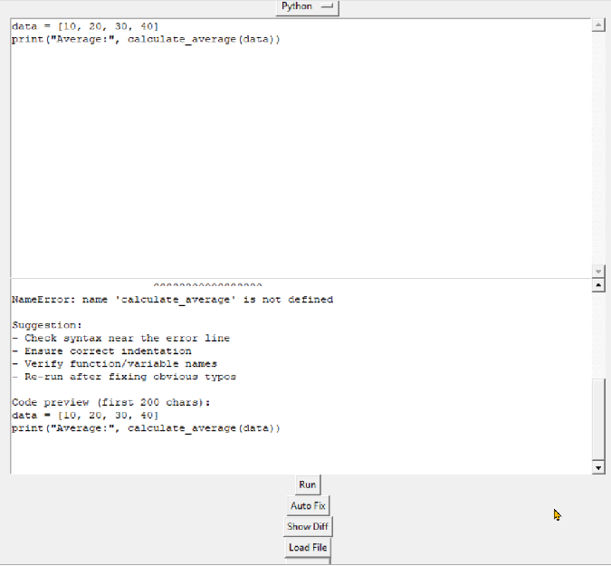
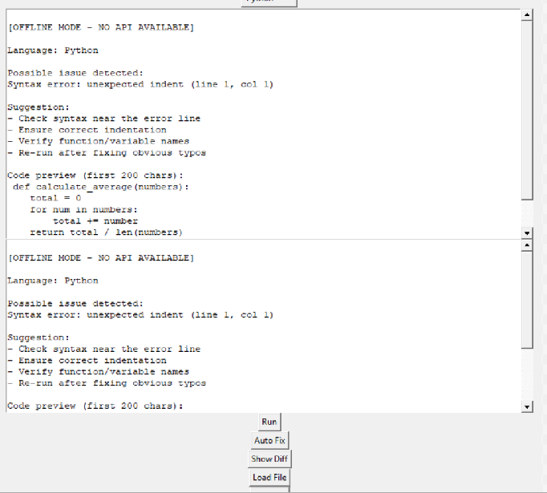

    # 🚀 AI Debugger Pro

```markdown
Run code → detect failure → trace execution → get fix suggestions

AI Debugger Pro automatically detects, analyzes, and fixes runtime errors using execution-aware AI.

Supports Python, C, C++, and Java with isolated execution pipelines.

Designed as a runtime-aware debugging system—not just a static code analyzer.

AI Debugger Pro allows you to write, run, and debug code across multiple languages while receiving intelligent suggestions in a lightweight desktop interface.

Why this matters:

Debugging is slow and manual.

AI Debugger Pro introduces execution-aware debugging,
reducing time to identify and fix runtime issues.

Built for developers who want faster debugging cycles with real-time feedback and AI-assisted fixes.

---

## 📄 Research Paper (optional)

- [Read on GitHub](docs/paper.md)
- [Download PDF](docs/ai-debugger-pro-paper.pdf)

---

Watch how a runtime error is detected, analyzed, and fixed in real time:

## 🎥 Demo



## ⚡ Example

**Input**
```python
def divide(a, b):
    return a / b

print(divide(10, 0))

Output

*Detects ZeroDivisionError
*Shows variable state at failure (b = 0)
*Suggests fix: add conditional check for zero
---

## 🖥️ Interface Preview



---

## 📸 Additional Screenshots

### Execution History


### Code Fix / Diff View


---

## ✨ Features

- ⚡ Real-time syntax checking (debounced, non-blocking UI)
- 🧠 AI-powered debugging suggestions
- 🖥️ Multi-language execution:
  - Python
  - C
  - C++
  - Java
- 🔍 Execution history tracking
- 🔄 Code diff comparison (before vs AI fix)
- 🧩 Modular plugin-style architecture
- 🚫 Safe execution via subprocess isolation + timeouts

---

## 🏗️ Architecture (High-Level)

Execution → Analysis → AI Reasoning → Feedback → History

Modules:
- executor.py → runs code securely
- analyzer.py → validates syntax
- ai_suggester.py → generates fixes
- history.py → tracks iterations
- gui.py → interactive interface

Execution → Analysis → AI Reasoning → Feedback → History (temporal memory)

---

## ⚙️ Installation

```bash
git clone https://github.com/Tybent18/ai-debugger-pro
cd ai-debugger-pro
pip install -r requirements.txt
```
---

## ▶️ Run

python gui.py