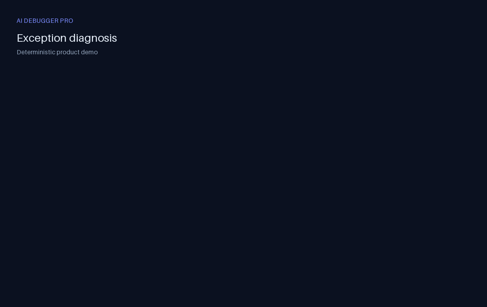

# AI Debugger Pro

**Run code, diagnose failures, preview repairs, and verify approved fixes from one desktop interface.**

[](https://github.com/Tybent18/ai-debugger-pro/actions/workflows/ci.yml)
[](https://www.python.org/)
[](LICENSE)

AI Debugger Pro is a local, security-conscious AI-assisted debugging workspace. It combines
deterministic execution with optional LLM-assisted error interpretation, supports Python, C, C++,
and Java, keeps persistent local history, and compares consecutive code versions.

> [!IMPORTANT]
> Docker is the default execution backend and applies defense-in-depth restrictions. No sandbox is
> an absolute security boundary; keep Docker updated and do not treat this prototype as a hosted
> execution service. Local execution is disabled unless explicitly selected.



### Feature demos

The showcase can be regenerated from the real desktop interface with deterministic offline data.
Each recording focuses on one part of the repair workflow:

#### Exception diagnosis

Captured traceback context and local variables turn a crash into an actionable explanation.


#### Approval-gated repair

The proposed source change remains a preview until the user explicitly approves it.


#### Regression verification

The approved repair is rerun and recorded alongside a focused regression check.


Generate every GIF locally on Linux:

```bash
python -m pip install -e ".[demo]"
xvfb-run --auto-servernum python tools/generate_demos.py
```

Use `--scenario approval-repair` to record only one workflow. The manual **Generate product
demos** GitHub Action produces the same files as a downloadable artifact without requiring an API
key or Docker.

## Desktop workspace

The desktop interface uses a dark IDE-style workspace with a line-numbered editor, resizable
history and result panels, and dedicated tabs for output, diagnoses, proposed diffs, and regression
tests. Repair states use distinct success, failure, warning, and loading indicators.

Keyboard shortcuts:

| Action | Shortcut |
| --- | --- |
| Run | `F5` |
| Diagnose | `Ctrl+D` |
| Apply and verify | `Ctrl+Enter` |
| Open | `Ctrl+O` |
| Save | `Ctrl+S` |

## Current capabilities

- Python syntax validation while typing
- Python, C, C++, and Java execution
- Compilation and runtime output capture
- Structured AI diagnoses for failed runs
- Proposed patch preview with unified diff
- Explicit approve/reject controls
- Automatic rerun after an approved repair
- Suggested regression-test generation
- Responsive background AI requests
- Persistent execution and repair history
- Unified diffs between recent code versions
- Open and save source files
- Docker execution with no network, resource limits, a read-only container root, dropped
  capabilities, and no inherited API secrets
- Python traceback frames with bounded local-variable representations
- Bounded multi-file project discovery for AI context
- CLI commands for execution, diagnosis, and project inspection
- Starter VS Code extension commands

## What it does not do yet

- Provide operating-system-grade isolation without Docker
- Trace every successful statement; current tracing focuses on exception frames
- Execute arbitrary multi-service projects as one unit

Those boundaries are deliberate: this README describes the current prototype, not its future
roadmap wearing a fake moustache.

## Requirements

- Python 3.10+
- Tkinter (included with most Python installations)
- Optional: an OpenAI API key for AI suggestions
- `gcc` for C, `g++` for C++, and a JDK providing `javac`/`java` for Java
- Docker for the default restricted execution backend

## Installation

### Download a desktop build

Tagged versions automatically produce standalone desktop executables for Windows, macOS, and
Linux. Download the appropriate bundle from the
[latest GitHub release](https://github.com/Tybent18/ai-debugger-pro/releases/latest).

The executable bundles the Python application; Docker remains required for the default restricted
execution backend.

### Install from source

```bash
git clone https://github.com/Tybent18/ai-debugger-pro.git
cd ai-debugger-pro
python -m venv .venv
```

Activate the virtual environment, then install the project:

```bash
python -m pip install -e .
```

For tests and linting:

```bash
python -m pip install -e ".[dev]"
```

## Configuration

AI suggestions are optional. Set the API key in your environment rather than placing it in code:

```bash
export OPENAI_API_KEY="your-key"
```

PowerShell:

```powershell
$env:OPENAI_API_KEY="your-key"
```

The model can be overridden with `OPENAI_MODEL`. Without a key, the application remains usable
and provides deterministic offline troubleshooting guidance.

## Run

```bash
python main.py
```

Launch the desktop interface after installation:

```bash
ai-debugger-pro-gui
```

Use the CLI:

```bash
ai-debugger-pro run examples/broken.py
ai-debugger-pro diagnose examples/broken.py --json
ai-debugger-pro project ./my-project
```

Docker is used by default. To deliberately run trusted code without Docker:

```bash
AI_DEBUGGER_EXECUTION_BACKEND=local AI_DEBUGGER_ALLOW_LOCAL_EXECUTION=1 ai-debugger-pro run app.py --backend local
```

## Example

```python
def divide(a, b):
    return a / b

print(divide(10, 0))
```

The application captures the `ZeroDivisionError`, requests a structured diagnosis, previews the
proposed correction as a diff, and waits for approval. An approved patch is applied and rerun so
the result is recorded as either a verified or failed repair.

## Architecture

```text
Editor -> Syntax check -> Language runner -> Captured failure
                                         -> Structured diagnosis
                                         -> Diff and approval gate
                                         -> Apply -> Rerun -> Verified result
                                         -> Persistent history
```

| Module | Responsibility |
| --- | --- |
| `core/analyzer.py` | Python syntax validation |
| `core/executor.py` | Local language execution and output capture |
| `core/sandbox.py` | Restricted Docker execution and exception-state capture |
| `core/project.py` | Bounded multi-file project discovery and context |
| `core/languages.py` | Language registry and routing |
| `core/ai_suggester.py` | Structured AI request with offline fallback |
| `core/diagnostics.py` | Validated repair proposal model |
| `core/history.py` | Persistent execution and repair history |
| `core/diff.py` | Unified code diffs |
| `interface/gui.py` | Tkinter desktop interface |
| `cli.py` | Scriptable command-line interface |
| `vscode-extension/` | VS Code command integration starter |

## Tests

```bash
pytest -q
ruff check .
```

GitHub Actions runs the same checks on Python 3.10 and 3.12.

## Research & publications

| Paper | Status | Focus |
| --- | --- | --- |
| [From Stateless Execution to Human-Governed AI Repair: The Evolution of AI Debugger Pro, Versions 0–6](docs/papers/01-system-evolution/system-evolution-v0-v6.pdf) | Complete | How the project evolved from a stateless runner into an approval-gated repair system |
| [AI Debugger Pro: Current Architecture and Human-Governed Repair Protocol](docs/papers/02-current-architecture/current-architecture-and-repair-protocol.pdf) | Complete | The authoritative current architecture, trust boundaries, and repair workflow |
| [Empirical Evaluation Protocol for Human-Governed AI-Assisted Repair](docs/papers/03-evaluation-protocol/empirical-evaluation-protocol.pdf) | Protocol complete; results pending | A preregistration-ready benchmark design for diagnosis, repair, verification, security, and human decision support |
| [AI Debugger Pro: Security Threat Model for Human-Governed AI-Assisted Repair](docs/papers/04-security-threat-model/security-threat-model.pdf) | Complete | Assets, adversaries, trust boundaries, scored risks, implemented controls, and a prioritized hardening roadmap |
| [AI Debugger Pro: Repair Verification, Evidence, and Trust](docs/papers/05-repair-verification-and-trust/repair-verification-and-trust.pdf) | Complete | An evidence ladder that separates rerun success, behavioral checks, regressions, policy, and reproducibility |
| [AI Debugger Pro: Multi-Language Execution Architecture](docs/papers/06-multi-language-execution/multi-language-execution-architecture.pdf) | Complete | A capability-driven architecture for Python, C, C++, and Java execution, diagnostics, provenance, and extension |
| [AI Debugger Pro: Human-in-the-Loop UX and Decision-Support Study Protocol](docs/papers/07-human-in-the-loop-ux/human-in-the-loop-ux-study-protocol.pdf) | Protocol complete; results pending | A preregistration-ready study of approval accuracy, automation bias, calibration, evidence comprehension, and workload |
| [AI Debugger Pro: Benchmark Results and Comparative Evaluation](docs/papers/08-benchmark-results/benchmark-results-and-comparative-evaluation.pdf) | Complete; measured baseline | A 24-case multi-language execution benchmark with latency, evidence-coverage, and CI results |
| [AI Debugger Pro: Failure Taxonomy for AI-Assisted Debugging](docs/papers/09-failure-taxonomy/failure-taxonomy-for-ai-assisted-debugging.pdf) | Complete; measured taxonomy | A failure taxonomy grounded in the benchmark's observed syntax, compile, runtime, timeout, and evidence-gap data |
| [AI Debugger Pro: Context Selection and Diagnostic Relevance](docs/papers/10-context-selection/context-selection-and-diagnostic-relevance.pdf) | Complete; design specification | A governed architecture for selecting relevant, bounded, fresh, private, and attributable debugging context |
| [AI Debugger Pro: Regression-Test Generation and Independent Oracles](docs/papers/11-regression-test-oracles/regression-test-generation-and-independent-oracles.pdf) | Complete; design specification | A provenance-aware admission architecture separating generated tests from independent verification authority |
| [AI Debugger Pro: Reproducible Engineering and Release Evidence](docs/papers/12-reproducible-engineering/reproducible-engineering-and-release-evidence.pdf) | Complete; series finale | An evidence graph connecting commits, environments, raw results, claims, release artifacts, and independent replication |

See the [publication catalog](docs/papers/README.md) for reading order and scope. The
[original AI Studio Debugger paper](docs/AI%20Studio%20Debugger.pdf) is retained as a historical
V0–V4 snapshot.

## License

MIT
