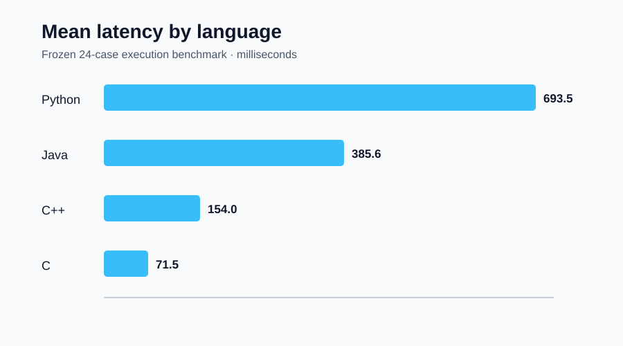
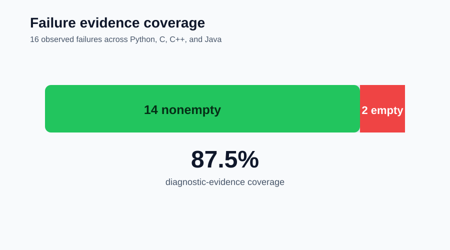

# AI Debugger Pro: Benchmark Results and Comparative Evaluation

> [← Paper 7: Human-in-the-Loop UX](../07-human-in-the-loop-ux/human-in-the-loop-ux-study-protocol.md) · [Publication catalog](../README.md) · [Paper 9: Failure Taxonomy →](../09-failure-taxonomy/failure-taxonomy-for-ai-assisted-debugging.md)

---

**T. R. Bentley**  
Measured Results Paper | September 2026  
Repository: Tybent18/ai-debugger-pro | Assessed baseline: Phase 6

## Abstract

This paper reports the first frozen execution benchmark for AI Debugger Pro. Twenty-four cases spanning Python, C, C++, and Java were executed under controlled local conditions. The corpus includes successful execution, syntax or compilation failure, runtime failure, and timeout behavior. All 24 cases matched their expected success/failure classification, yielding 100% classification agreement on this fixed corpus. Median latency was 282.969 ms and mean latency was 351.798 ms. Fourteen of sixteen failure cases produced nonempty diagnostic evidence. The two empty cases were nonzero runtime exits in C and C++ that wrote nothing to standard error. The current continuous-integration baseline also passed 27 tests on Python 3.10 and Python 3.12. These results establish an auditable engineering baseline; they do not measure model repair correctness, semantic generalization, or production security.

## 1. Research questions

- Does the execution layer correctly distinguish expected success from expected failure on the frozen corpus?
- What latency is observed by language and failure class?
- When execution fails, does the system return evidence that can support diagnosis?
- Does the same repository state pass its automated CI checks on supported Python versions?

## 2. Corpus and procedure

The frozen corpus contains eight Python cases, six C cases, six C++ cases, and four Java cases. Each row fixes the language, case class, expected success state, and program. The runner records observed success, classification agreement, latency, whether evidence is nonempty, and a bounded output excerpt.

The benchmark intentionally includes syntax or compile failures, runtime failures, timeouts, and successful executions. Local execution was used for this run. Timing includes interpreter startup or compilation and must be interpreted as environment-specific engineering telemetry rather than a portable performance guarantee.

## 3. Measured results

| Metric | Result |
| --- | ---: |
| Attempted cases | 24 |
| Classification matches | 24 |
| Classification accuracy | 100% |
| Median latency | 282.969 ms |
| Mean latency | 351.798 ms |
| Failure cases | 16 |
| Failures with nonempty evidence | 14 |
| Failure-evidence coverage | 87.5% |
| CI tests passed, Python 3.10 | 27 |
| CI tests passed, Python 3.12 | 27 |

Python had the largest observed mean latency in this run because each case paid interpreter and harness overhead. C was fastest on average; C++ and Java included compiler or virtual-machine startup costs. These values are useful for this recorded environment only.

## 4. Evidence coverage

All Python and Java failure cases returned nonempty evidence. Compilation and timeout failures also returned evidence across the tested languages. Two native runtime cases—one C and one C++—returned a nonzero exit status without writing to standard error. The system correctly classified both as failures, but the diagnostic payload was empty.

This distinction matters: classification correctness and diagnostic usefulness are separate measurements. A debugger can know that execution failed while still lacking enough evidence to explain why.

## 5. Comparative interpretation

The benchmark supports a strong but narrow claim: the tested execution layer correctly classified every fixed case in this corpus. It does not support the stronger claim that AI-generated repairs are correct. A zero exit status proves only that one execution completed successfully for the supplied input and backend. It does not establish semantic correctness, regression freedom, security, or generality.

The evidence-coverage result exposes the most actionable defect. Native nonzero exits should produce a synthetic diagnostic containing at least the exit code and language runner identity when both stdout and stderr are empty.

## 6. Reproducibility and data allocation

- [Frozen case-level data](data/frozen-execution-benchmark-raw.csv)
- [Measured summary data](data/measured-results.csv)
- [Mean-latency chart](charts/mean-latency-by-language.svg)
- [Failure-evidence chart](charts/failure-evidence-coverage.svg)
- [Rendered PDF](benchmark-results-and-comparative-evaluation.pdf)

The CSV files are the numerical source of truth. Charts are derived views. The PDF is the publication rendering, while this Markdown file is the accessible, navigable edition.

## 7. Limitations

The corpus is small and researcher-authored. It is not sampled from real-world defect prevalence. Latency was measured on one environment. The benchmark measures execution classification and diagnostic evidence, not root-cause accuracy or repair success. CI results demonstrate regression-suite stability, not external validity. No private LinkedIn analytics or uncontrolled tester reports are included.

## 8. Conclusion

AI Debugger Pro now has a frozen, inspectable baseline rather than a cloud of adjectives. Twenty-four of twenty-four classifications matched expectation, both supported CI jobs passed 27 tests, and the benchmark revealed a concrete evidence gap for silent native runtime failures. That is useful engineering evidence precisely because its boundaries are explicit.

---

[← Paper 7](../07-human-in-the-loop-ux/human-in-the-loop-ux-study-protocol.md) · [All papers](../README.md) · [Paper 9 →](../09-failure-taxonomy/failure-taxonomy-for-ai-assisted-debugging.md)
