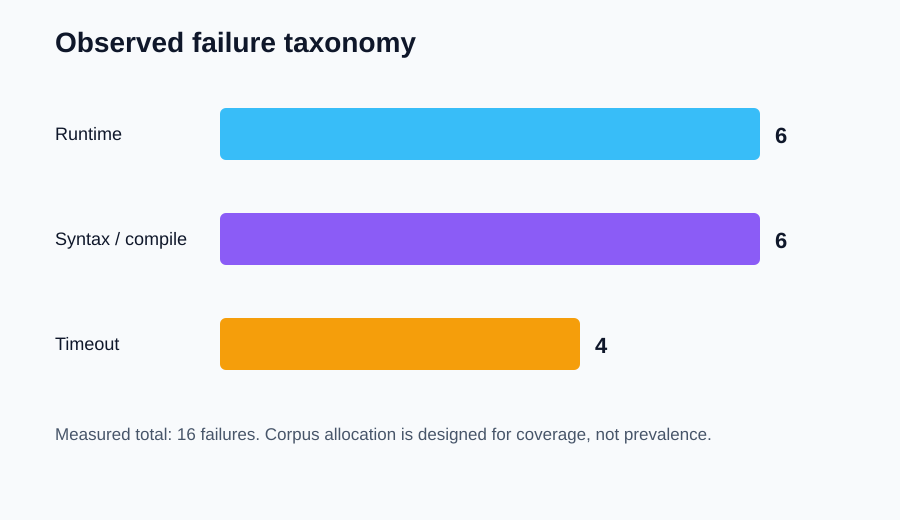
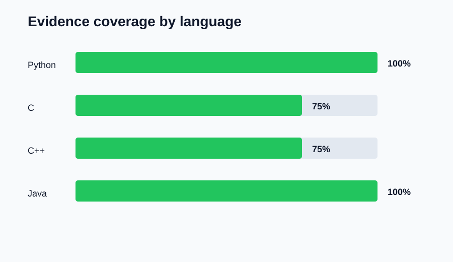

# AI Debugger Pro: Failure Taxonomy for AI-Assisted Debugging

> [← Paper 8: Benchmark Results](../08-benchmark-results/benchmark-results-and-comparative-evaluation.md) · [Publication catalog](../README.md) · [Publication catalog →](../README.md)

---

**T. R. Bentley**  
Measured Taxonomy Paper | September 2026  
Repository: Tybent18/ai-debugger-pro | Evidence source: Paper 8 frozen benchmark

## Abstract

This paper develops a failure taxonomy for AI-assisted debugging grounded in the 24-case frozen execution benchmark reported in Paper 8. Sixteen observed failures are allocated across syntax or compilation failures, runtime failures, and timeouts for Python, C, C++, and Java. Fourteen failures produced nonempty diagnostic evidence. Two failures—silent nonzero exits in C and C++—were correctly classified but returned empty evidence. The taxonomy separates execution outcome, failure phase, evidence availability, diagnostic actionability, and verification scope. This separation prevents a common category error: treating detection of failure as explanation of failure, or treating successful rerun as proof of repair correctness.

## 1. Why a taxonomy is necessary

AI-assisted debugging joins multiple systems that fail differently: parsers, compilers, runtimes, sandboxes, model services, repair proposals, verification steps, and human approval. A single red “failed” label collapses these meanings and weakens both diagnosis and research.

The taxonomy therefore asks five independent questions:

1. Did the program execute successfully?
2. In which lifecycle phase did failure occur?
3. What evidence was captured?
4. Is that evidence actionable for diagnosis?
5. What verification claim, if any, is justified?

## 2. Observed failure allocation

| Language | Runtime | Syntax/compile | Timeout | Total failures |
| --- | ---: | ---: | ---: | ---: |
| Python | 3 | 1 | 1 | 5 |
| C | 1 | 2 | 1 | 4 |
| C++ | 1 | 2 | 1 | 4 |
| Java | 1 | 1 | 1 | 3 |
| **Total** | **6** | **6** | **4** | **16** |

The measured corpus is balanced for coverage, not prevalence. Equal totals across major classes are a property of the benchmark design and must not be read as estimates of real-world frequency.

## 3. Taxonomy dimensions

### 3.1 Failure phase

- **Syntax or compilation:** source cannot become an executable program under the selected language toolchain.
- **Runtime:** a program begins execution but terminates unsuccessfully.
- **Timeout:** execution does not complete inside the configured limit.
- **Infrastructure:** a required compiler, runtime, container backend, or model service is unavailable.
- **Repair:** a candidate fails to restore intended behavior.
- **Verification:** evidence is insufficient, stale, internally generated, or scoped too narrowly for the asserted claim.
- **Human decision:** a reviewer accepts an unsafe candidate or rejects a beneficial repair.

Only the first three classes were quantitatively measured in the frozen benchmark. The remaining classes are architectural extensions for future studies.

### 3.2 Evidence state

Evidence is classified as structured, textual, partial, empty, unavailable, or stale. Evidence is actionable when it identifies a failure phase and gives enough information to choose a next diagnostic step. Nonempty text is not automatically actionable; a giant compiler avalanche can be just as foggy as silence.

## 4. Measured evidence gap

| Language | Observed failures | Nonempty evidence | Empty evidence | Coverage |
| --- | ---: | ---: | ---: | ---: |
| Python | 5 | 5 | 0 | 100% |
| C | 4 | 3 | 1 | 75% |
| C++ | 4 | 3 | 1 | 75% |
| Java | 3 | 3 | 0 | 100% |
| **Total** | **16** | **14** | **2** | **87.5%** |

Both empty records were native runtime failures with nonzero exits and no emitted standard error. This is not a classification defect: the system correctly returned failure. It is an evidence defect because the user and diagnosis layer receive no explanation.

A minimum synthetic message such as “C program exited with code 3 and produced no stderr” would convert the state from empty to structured partial evidence without inventing a root cause.

## 5. Implications for AI-assisted diagnosis

A model should receive typed provenance before free-form output: language, lifecycle phase, backend, return code, timeout state, stdout/stderr presence, and source hash. When evidence is empty or partial, the appropriate behavior may be an abstention or a request for instrumentation rather than a confident repair.

Compiler output and tracebacks support different reasoning. Compiler failures often contain location and expected-token information. Runtime failures may contain exception type, stack, and locals. Timeouts identify a resource-bound outcome but rarely identify the exact loop or blocking operation. Silent exits prove even less.

## 6. Verification labels

| Label | Meaning |
| --- | --- |
| Execution failed | The selected run returned a failure state |
| Failure detected; evidence incomplete | Failure is known, but diagnostic material is partial or empty |
| Candidate rerun passed | One candidate execution completed successfully |
| Behavioral checks passed | Declared independent tests passed |
| Regression checks passed | The declared regression suite passed |
| Verification inconclusive | Available evidence cannot support acceptance |
| Policy blocked | A security or governance rule prevented acceptance |

The existing verified-fix label should not be interpreted as semantic correctness unless the attached evidence supports that scope.

## 7. Data and reproducibility

- [Failure-taxonomy data](data/failure-taxonomy-data.csv)
- [Observed-class chart](charts/observed-failure-taxonomy.svg)
- [Evidence-gap chart](charts/evidence-gap-by-language.svg)
- [Paper 8 raw benchmark](../08-benchmark-results/data/frozen-execution-benchmark-raw.csv)
- [Rendered PDF](failure-taxonomy-for-ai-assisted-debugging.pdf)

Every quantitative statement in this Markdown edition maps to the CSV. The taxonomy distinguishes measured rows from proposed future categories.

## 8. Limitations and next steps

The benchmark is small, deterministic, and single-file. It does not include dependency resolution, multi-service failures, flaky tests, race conditions, data corruption, security-policy violations, stale proposals, or human decision errors. Future datasets should add these classes with independent labels and adjudication.

The immediate engineering improvement is to synthesize a nonempty diagnostic for silent native exits. The immediate research improvement is to measure diagnostic actionability separately from simple nonemptiness.

## 9. Conclusion

Failure is not one bucket; it is a trail of broken evidence. The measured taxonomy shows that AI Debugger Pro reliably detected the frozen failures but did not always explain them. Separating phase, evidence state, actionability, and verification scope turns that gap into a concrete engineering target instead of a mysterious red light.

---

[← Paper 8](../08-benchmark-results/benchmark-results-and-comparative-evaluation.md) · [All papers](../README.md)
