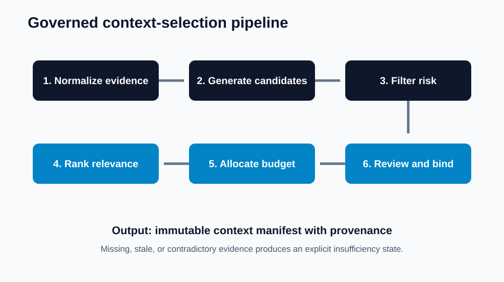
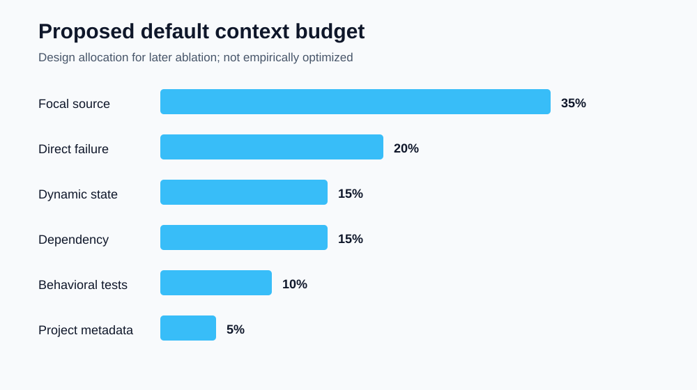
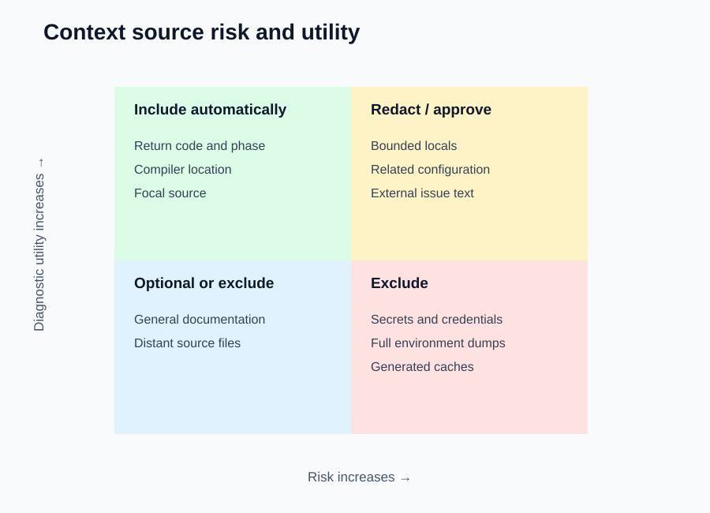

# AI Debugger Pro: Context Selection and Diagnostic Relevance

> [← Paper 9: Failure Taxonomy](../09-failure-taxonomy/failure-taxonomy-for-ai-assisted-debugging.md) · [Publication catalog](../README.md)

---

**T. R. Bentley**  
Context Engineering Paper | September 2026  
Repository: Tybent18/ai-debugger-pro | Assessed baseline: Phase 6

## Abstract

AI-assisted debugging depends not only on model capability but on which evidence reaches the model, how it is bounded, and whether its provenance remains visible. AI Debugger Pro currently supplies source code and captured error output to structured diagnosis while also supporting bounded project discovery and Python exception-state capture. This paper defines a context-selection architecture that ranks evidence by diagnostic relevance, freshness, trust, privacy risk, and token cost. It introduces a typed context manifest, failure-directed selection stages, exclusion rules, deterministic budgets, provenance requirements, and abstention behavior for insufficient evidence. Two design datasets accompany the paper: a context-source matrix and twelve frozen selection scenarios. Three diagrams make the policy auditable. These artifacts are specifications for implementation and later evaluation; they are not reported model-performance results. The central claim is architectural: context should be treated as a governed evidence package, not a convenient text dump.

## 1. Motivation

More context is not automatically better. Large undifferentiated prompts can bury the failing line, expose unrelated secrets, import prompt-injection text from project files, and consume the token budget before the most relevant evidence appears. Too little context creates the opposite problem: plausible diagnoses untethered from imports, call sites, configuration, or runtime state.

The useful target is sufficient, minimal, fresh, and attributable context. Every included item should answer why it is present, which failure hypothesis it informs, and what privacy or integrity risk it carries.

## 2. Repository-grounded baseline

The current diagnosis request includes language, source code, and error output. Python sandbox execution can capture bounded exception frames and local-variable representations. Project discovery can collect bounded text from supported files while excluding common generated and hidden directories. These capabilities provide raw material but not yet a unified ranking policy, immutable context manifest, or source-to-prompt provenance ledger.

Paper 8 measured 87.5% nonempty failure-evidence coverage in the frozen execution benchmark. Paper 9 showed why nonempty evidence and actionable evidence are different categories. Paper 10 addresses the next question: when evidence exists, which pieces should be selected for diagnosis?

## 3. Design objectives

| ID | Objective | Operational requirement |
| --- | --- | --- |
| O1 | Relevance | Prefer evidence tied to the failing phase, location, symbol, or call path |
| O2 | Minimality | Exclude material that does not change a declared diagnostic hypothesis |
| O3 | Freshness | Bind context to source, failure, environment, and proposal hashes |
| O4 | Privacy | Exclude secrets, credentials, unrelated personal data, and raw environment dumps |
| O5 | Integrity | Treat repository text as untrusted data, never hidden instructions |
| O6 | Reproducibility | Record selection policy version, ordering, truncation, and hashes |
| O7 | Language parity | Express shared contracts while retaining language-specific evidence |
| O8 | Abstention | Report insufficiency when required context is missing or contradictory |

## 4. Typed context manifest

Each selected item should carry a stable identifier, source kind, language, origin path, content hash, source-version hash, failure signature, capture timestamp, byte and token estimates, trust class, sensitivity class, selection score, truncation state, and inclusion rationale.

A context package should be immutable after diagnosis begins. If source or failure state changes, the proposal becomes stale and requires a new package. This prevents a correct diagnosis for yesterday's code from silently becoming authority over today's edit.

## 5. Context sources

The design recognizes six evidence families:

1. Direct failure evidence: return code, timeout, compiler output, traceback, phase, backend.
2. Focal source: failing line, containing function or class, and bounded neighboring lines.
3. Dynamic state: bounded locals, argument values, exception chain, and safe representations.
4. Dependency context: imports, declarations, interfaces, call sites, and build metadata.
5. Behavioral evidence: independent tests, failing assertions, expected outputs, and regressions.
6. Project context: narrowly selected configuration, documentation, and related source files.

Direct failure evidence and focal source normally enter first. Broader project material must earn its place through a declared dependency or hypothesis.

## 6. Selection pipeline

### 6.1 Normalize

Convert runner output into typed fields. Preserve raw evidence separately. Identify language, lifecycle phase, location candidates, exception or compiler class, symbols, and toolchain provenance.

### 6.2 Generate candidates

Create bounded candidates from the focal source, stack or compiler locations, imports, project graph, tests, and related declarations. Apply path, size, binary, generated-file, and sensitivity exclusions before ranking.

### 6.3 Score

A practical score can combine relevance, proximity, freshness, trust, and expected information gain, then subtract privacy risk, injection risk, redundancy, and token cost. Scores are decision aids, not truth probabilities.

### 6.4 Allocate budget

Reserve capacity by evidence tier instead of allowing early files to consume the entire prompt. Critical failure evidence is non-negotiable. Focal source receives the largest flexible share. Dependency and project context compete only after critical evidence is secured.

### 6.5 Serialize with provenance

Use typed sections with stable delimiters. Attach item identifiers and hashes. Mark all repository content as untrusted evidence. Never blend project text into system instructions.

### 6.6 Validate sufficiency

Before model invocation, check that required fields for the failure class are present. Contradictory, empty, or stale evidence should trigger an explicit incomplete-context state.

## 7. Budget policy

The default design allocation reserves 20% for direct failure evidence, 35% for focal source, 15% for dynamic state, 15% for dependency context, 10% for independent behavioral evidence, and 5% for project metadata. Unused capacity may flow downward, but critical evidence may not be displaced by lower tiers.

These percentages are design defaults for evaluation, not empirically optimized values. Later ablations should compare them against source-only, error-only, unbounded-project, and adaptive policies.

## 8. Risk and utility

High-utility, low-risk sources should enter automatically. High-utility, high-risk sources require redaction or explicit approval. Low-utility, high-risk material should be excluded. Secrets, full environment dumps, dependency caches, generated binaries, version-control internals, and unrelated user files should never be included by convenience.

Local variables are especially delicate: they can explain a defect while containing credentials, tokens, personal data, or enormous object graphs. Capture must be bounded, redacted, typed, and visible to the reviewer.

## 9. Language-specific policy

| Language | Priority evidence | Common omission risk |
| --- | --- | --- |
| Python | Traceback frames, exception chain, bounded locals, imports | Dynamic types and hidden runtime state |
| C | Compiler diagnostics, return code, declarations, headers | Silent exits, undefined behavior, macro context |
| C++ | Template/compiler diagnostics, types, headers, stack evidence | Diagnostic floods and overload ambiguity |
| Java | Exception chain, classpath/build metadata, declarations | Missing dependency and package context |

Shared fields support comparison, but identical prompts across languages would erase meaningful semantics.

## 10. Frozen design scenarios

The accompanying scenario dataset contains twelve prespecified situations covering syntax, compilation, runtime, timeout, missing dependency, stale evidence, project prompt injection, secrets in locals, diagnostic floods, test failures, ambiguous intent, and silent native exits. Each row states required context, excluded context, and the expected selection action.

The scenarios validate deterministic policy behavior. They do not measure model accuracy. Future evaluation should execute every scenario against a versioned selector and record inclusion precision, critical-evidence recall, sensitive-item leakage, token use, and diagnosis outcomes.

## 11. Evaluation protocol

Primary selector metrics should include:

- Critical-evidence recall: required items included divided by required items.
- Context precision: useful selected items divided by all selected items.
- Sensitive leakage rate: prohibited items included divided by prohibited items presented.
- Stale-context rejection: stale packages blocked divided by stale packages presented.
- Budget compliance: packages within the declared token cap.
- Determinism: identical inputs and policy versions produce identical manifests.
- Diagnosis lift: change in blinded root-cause accuracy relative to ablation baselines.

Diagnosis lift requires independently labeled defects and must not be inferred from selector-only tests.

## 12. Security and prompt injection

Repository files, comments, logs, issue text, and generated artifacts may contain instruction-like language. The selector should label origin and trust class, escape boundaries, and prevent those strings from becoming higher-priority instructions. Content that says to ignore policy remains data describing a project, not authority.

Secret scanning and path exclusions should occur before ranking. Redaction decisions must be recorded without storing the secret itself. A hash may support deduplication, but hashing low-entropy secrets is not safe anonymization.

## 13. Human review

Before sending context externally, the interface should show a compact manifest: selected items, excluded items, truncation, sensitivity warnings, estimated size, and reasons. Reviewers should be able to remove optional context, but not silently remove evidence required to interpret the resulting confidence.

The model's diagnosis should cite context item identifiers. Clicking an identifier should reveal the exact local evidence and its provenance. This makes explanation review concrete instead of ceremonial.

## 14. Implementation roadmap

### Phase A: manifest foundation

Introduce typed context items, hashing, freshness binding, deterministic ordering, and serialization tests.

### Phase B: failure-directed selection

Add parsers for traceback, compiler location, return-code, timeout, and symbol evidence. Implement per-language candidate generation and hard exclusions.

### Phase C: governance

Add sensitivity classification, redaction, prompt-injection boundaries, user preview, stale-context invalidation, and audit events.

### Phase D: evaluation

Run the frozen scenarios, ablations, independently labeled defect corpus, and human comprehension study. Publish raw manifests and aggregation code.

## 15. Data availability

- [Context-source matrix](data/context-source-matrix.csv)
- [Frozen selection scenarios](data/selection-scenarios.csv)
- [Selection pipeline](charts/context-selection-pipeline.svg)
- [Proposed budget](charts/proposed-context-budget.svg)
- [Risk-utility map](charts/context-risk-utility.svg)
- [Rendered PDF](context-selection-and-diagnostic-relevance.pdf)

The CSV files and charts describe the proposed architecture. They are specification artifacts, not participant observations or model-performance measurements.

## 16. Limitations

The selection score and budget shares are not yet empirically optimized. The present repository does not expose a full dependency graph or execute arbitrary multi-service projects. Static secret and injection detection will have false positives and false negatives. Context relevance also depends on intent, which may be genuinely ambiguous.

## 17. Conclusion

A debugging model cannot reason from evidence it never receives, and it should not receive an entire repository merely because the token window is large. Context selection is the narrow gate between those failures. The proposed architecture makes that gate typed, bounded, reviewable, reproducible, and honest about insufficiency.

---

[← Paper 9](../09-failure-taxonomy/failure-taxonomy-for-ai-assisted-debugging.md) · [All papers](../README.md)
