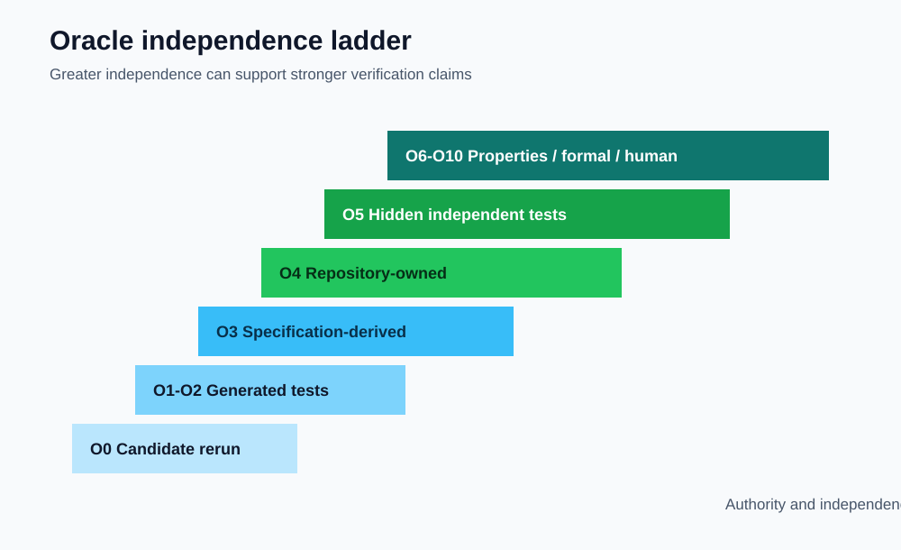
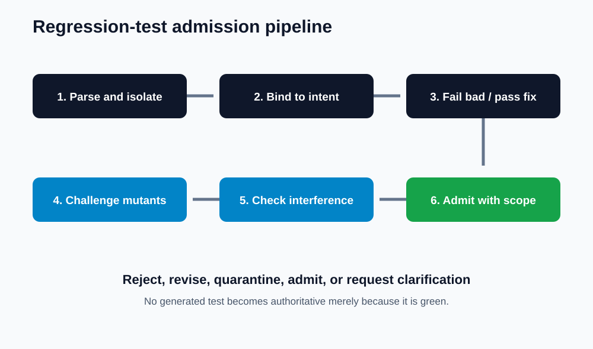
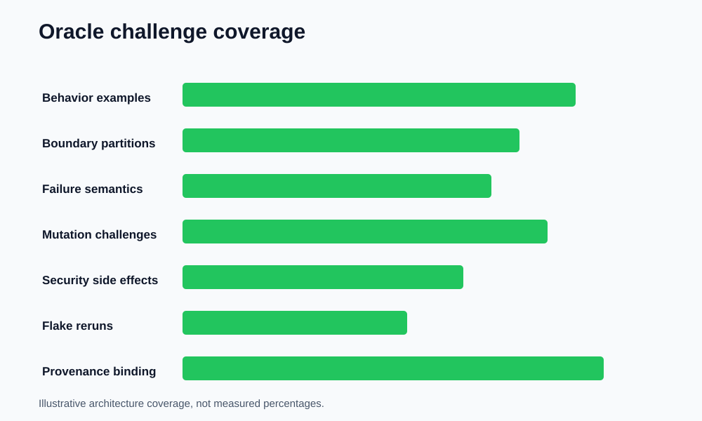

# AI Debugger Pro: Regression-Test Generation and Independent Oracles

> [← Paper 10: Context Selection](../10-context-selection/context-selection-and-diagnostic-relevance.md) · [Publication catalog](../README.md)

---

**T. R. Bentley**  
Verification Engineering Paper | September 2026  
Repository: Tybent18/ai-debugger-pro | Assessed baseline: Phase 6

## Abstract

AI-assisted repair systems often generate a patch and a regression test in the same model response. That pairing is convenient but epistemically weak: a test authored by the same process that proposed the repair can encode the same misunderstanding, assert only the visible example, weaken expected behavior, or simply ratify its own patch. AI Debugger Pro currently displays and can save a suggested regression test, while approved source is rerun and labeled according to that execution. This paper defines an architecture for separating test generation from repair authority. It introduces oracle provenance classes, test admission gates, mutation-based challenge checks, held-out behavioral validation, language-specific harness contracts, evidence labels, and human review requirements. Two downloadable design datasets specify twelve oracle sources and sixteen frozen regression scenarios. Three diagrams expose the verification flow and independence hierarchy. These artifacts are architectural specifications for implementation and later measurement; they are not reported repair-accuracy results. The governing principle is simple: a repair may propose its own witness, but it cannot appoint that witness as judge.

## 1. Motivation

A successful rerun establishes only that one execution completed under one input and environment. A generated test can broaden evidence, but only if it meaningfully challenges the candidate. When the repair and test share a generator, prompt, context package, and assumptions, agreement between them is correlated rather than independent.

The danger is subtle. A syntactically valid test may check the wrong requirement. A test can duplicate the observed failure, assert a hard-coded answer, omit boundaries, mock away the defect, or weaken an existing oracle. Green output can therefore increase confidence while adding almost no information.

## 2. Repository-grounded baseline

The current structured diagnosis model contains a regression-test field. The interface displays that suggestion and allows it to be saved. Approved replacement source is rerun, and the result is recorded as a verified or failed repair. Repository tests are not automatically discovered, selected, or executed as part of that approval flow.

This is a useful human-governed baseline, but its evidence labels must remain scoped. A candidate rerun and a model-suggested test are not substitutes for repository-owned behavior, hidden cases, security policy, or independent review.

## 3. Oracle provenance classes

| Level | Oracle source | Independence | Default authority |
| --- | --- | --- | --- |
| O0 | Candidate self-rerun | None | Execution evidence only |
| O1 | Same-response generated test | Very low | Suggestion; never sole acceptance gate |
| O2 | Separately generated test with shared context | Low | Challenge evidence |
| O3 | Researcher-authored or specification-derived test | Medium | Admission candidate |
| O4 | Repository-owned preexisting test | High | Regression authority |
| O5 | Hidden, independently curated test | High | Evaluation authority |
| O6 | Property, metamorphic, differential, or formal oracle | Variable but auditable | Strong when assumptions are declared |
| O7 | Human-adjudicated requirement | High for intent | Ground truth after documented review |

Independence is not a binary property. A hidden test copied from the same flawed specification may remain correlated. Provenance must record author, creation time, source requirement, context overlap, visibility to the repair generator, and modification history.

## 4. Test artifact contract

Every proposed test should contain a stable identifier, target language and framework, oracle class, requirement reference, preconditions, fixtures, inputs, expected behavior, failure mode targeted, source and proposal hashes, generator identity, creation timestamp, context-manifest hash, mutation score when available, observed outcomes, and admission state.

Tests are immutable after execution evidence is attached. Editing a test creates a new version and invalidates prior outcomes. A candidate cannot gain authority by silently rewriting the check that rejected it.

## 5. Admission pipeline

### Gate 1: Parse and isolate

The test must parse, use an allowed framework, avoid undeclared network or shell behavior, and execute inside the declared sandbox.

### Gate 2: Bind intent

The test must cite an independent requirement, repository behavior, issue acceptance criterion, or reviewer-approved invariant. Restating the proposed patch is not an intent source.

### Gate 3: Demonstrate discriminatory power

A regression test should fail on the known-bad version and pass on the approved candidate. If it passes before the repair, it may still be useful as coverage, but it does not reproduce the defect.

### Gate 4: Challenge alternatives

Run the test against mutants, overfit candidates, suppressive candidates, and known-wrong implementations. A test that accepts obvious alternatives has weak discriminatory value.

### Gate 5: Check noninterference

The test must not weaken, delete, skip, broadly mock, or replace stronger repository tests. It should not alter production behavior to manufacture a pass.

### Gate 6: Admit with scoped authority

Only admitted tests enter the verification suite. Their labels state origin and scope. Generated tests remain visibly generated even after human approval.

## 6. Failure modes

| ID | Failure mode | Example | Required response |
| --- | --- | --- | --- |
| T1 | Visible-example duplication | Repeats only the crashing input | Add boundaries and alternate partitions |
| T2 | Patch mirroring | Asserts the exact new implementation detail | Assert behavior, not mechanism |
| T3 | Constant-answer acceptance | Passes a hard-coded repair | Add varied inputs and properties |
| T4 | Exception suppression | Accepts default output after swallowed error | Assert intended semantics and error policy |
| T5 | Test weakening | Removes or relaxes an existing assertion | Block and preserve original oracle |
| T6 | Over-mocking | Replaces the component containing the defect | Reduce mock boundary |
| T7 | Environmental dependence | Relies on network, clock, locale, or ordering | Freeze or declare dependencies |
| T8 | Security blindness | Verifies output while ignoring dangerous side effects | Add policy and side-effect oracle |
| T9 | Flakiness | Nondeterministic timing or randomness | Stabilize seed and synchronization |
| T10 | Stale binding | Targets an older source or proposal | Invalidate and regenerate |
| T11 | Vacuous property | Assertion cannot fail | Reject during mutation/challenge checks |
| T12 | Oracle conflict | New test contradicts stronger ground truth | Escalate for adjudication |

## 7. Mutation and challenge testing

Mutation testing estimates whether a test distinguishes intended behavior from plausible errors. The design includes arithmetic operator changes, condition inversions, boundary shifts, removed exception paths, constant returns, skipped branches, altered loop limits, and removed security checks.

A mutation score is informative only for declared operators and reachable code. It is not proof of correctness. Surviving mutants identify gaps; killed mutants show discrimination against those specific alternatives.

The frozen scenario dataset assigns each proposed test an expected admission outcome and the challenge class it must reject. These scenarios validate the admission policy, not an AI model.

## 8. Independent oracle strategies

### Repository-owned regression suites

Preexisting tests have temporal independence from the proposed repair and should run unchanged. Their limitations, ownership, and coverage still matter.

### Specification-derived examples

Requirements can generate boundary partitions, equivalence classes, and invalid-input checks. Traceability connects each assertion to a declared behavior.

### Property and metamorphic tests

Properties evaluate relations rather than fixed answers: commutativity where valid, idempotence, round-trip behavior, monotonicity, conservation, or invariance under permitted transformations.

### Differential tests

Two independent implementations or trusted tools can be compared on generated inputs. Shared dependencies and common-mode failures must be disclosed.

### Human adjudication

Ambiguous intent requires a person to choose or refine the requirement. The system should not fabricate certainty where multiple behaviors are reasonable.

## 9. Language-specific harnesses

| Language | Default harness evidence | Primary risk |
| --- | --- | --- |
| Python | pytest outcome, assertion diff, exception chain, seed | Dynamic fixtures and excessive mocking |
| C | Compile flags, executable result, sanitizer output, return code | Undefined behavior and silent exits |
| C++ | Compiler profile, framework output, sanitizer evidence | Template complexity and toolchain variance |
| Java | JUnit outcome, exception chain, classpath and build metadata | Hidden dependency and lifecycle state |

A shared result schema should record build, discovery, execution, assertion, timeout, policy, and artifact evidence without pretending the phases are identical.

## 10. Evidence labels

Recommended labels include candidate rerun passed, generated challenge passed, repository regression suite passed, hidden evaluation passed, property checks passed, security policy passed, and verification inconclusive. Each label identifies the exact tests, versions, environment, and provenance.

The word verified should never stand alone. Verification is always verified against something.

## 11. Human review and authority

The review surface should show test origin, requirement link, code diff, affected production lines, failure on the bad version, pass on the candidate, mutation challenges, side effects, and conflicts with existing tests. Reviewers may admit, revise, reject, or request additional evidence.

Approval changes the test's governance state; it does not rewrite its provenance. A generated test remains generated.

## 12. Frozen design scenarios

The accompanying dataset contains sixteen scenarios: correct regression reproduction, visible-example duplication, constant-answer overfit, swallowed exception, assertion weakening, skipped test, over-mocking, network dependence, clock dependence, random flakiness, stale source binding, security side effect, vacuous assertion, property test, differential oracle, and ambiguous intent.

Each scenario declares proposed origin, expected bad-version result, expected candidate result, challenge requirement, and admission disposition. These rows are executable specifications for future tooling.

## 13. Evaluation plan

Primary test-generation measures should include defect reproduction, candidate validation, mutation score, overfit detection, suppressive-repair detection, security-side-effect detection, flaky-test rate, sensitive-data leakage, admission precision, and admission recall.

Model comparisons require a frozen defect corpus, fixed prompts and context policies, independent hidden oracles, repeated trials where nondeterminism matters, and blinded adjudication. Generated tests must never label themselves.

## 14. Implementation roadmap

### Phase A: provenance and storage

Add immutable test artifacts, source/proposal binding, origin classes, hashes, and evidence records.

### Phase B: discovery and execution

Discover repository tests, run them unchanged, add language adapters, and separate build failures from assertion failures.

### Phase C: admission and challenges

Implement fail-before/pass-after checks, mutation operators, static policy checks, flake reruns, and oracle-conflict handling.

### Phase D: interface and study

Expose admission evidence, origin, scope, and conflicts. Run the frozen scenarios, repair benchmark, and human comprehension study.

## 15. Data availability

- [Oracle-source matrix](data/oracle-source-matrix.csv)
- [Frozen regression scenarios](data/regression-test-scenarios.csv)
- [Oracle independence ladder](charts/oracle-independence-ladder.svg)
- [Admission pipeline](charts/regression-test-admission-pipeline.svg)
- [Challenge-coverage map](charts/oracle-challenge-coverage.svg)
- [Rendered PDF](regression-test-generation-and-independent-oracles.pdf)

The datasets and charts are design specifications, not measured repair or test-generation performance.

## 16. Limitations

Independence can be misclassified when sources share hidden assumptions. Mutation operators approximate plausible faults but cannot enumerate them. Repository tests may encode legacy defects. Property tests can formalize the wrong property. Human adjudication is necessary when intent remains ambiguous.

## 17. Conclusion

A generated regression test can be useful evidence, but it cannot certify the repair that inspired it. Separating provenance, admission, challenge power, and authority turns tests from decorative green lights into accountable witnesses. The repair may call the witness; the verification system decides whether the testimony holds.

---

[← Paper 10](../10-context-selection/context-selection-and-diagnostic-relevance.md) · [All papers](../README.md)
