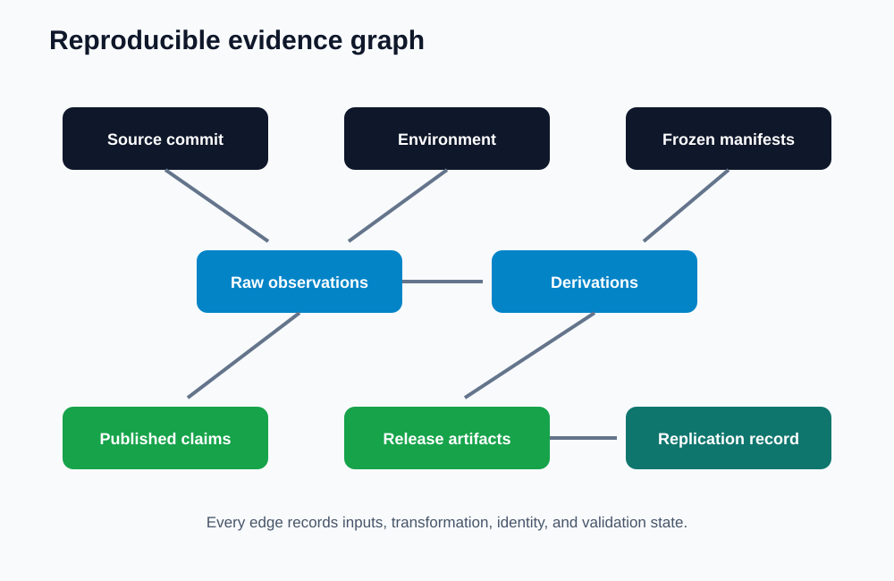
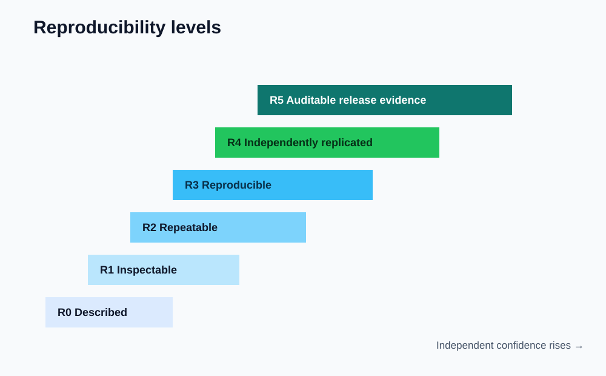
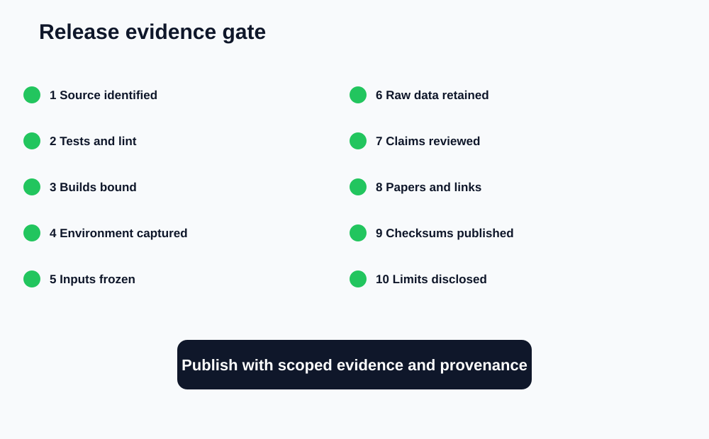

# AI Debugger Pro: Reproducible Engineering and Release Evidence

> [← Paper 11: Regression-Test Oracles](../11-regression-test-oracles/regression-test-generation-and-independent-oracles.md) · [Publication catalog](../README.md)

---

**T. R. Bentley**  
Reproducible Engineering Report | September 2026  
Repository: Tybent18/ai-debugger-pro | Series finale: Papers 1–12

## Abstract

AI systems are often demonstrated through screenshots, selected examples, and claims whose underlying code, environment, prompts, tests, and artifacts cannot be reconstructed. This paper defines a reproducible engineering and release-evidence architecture for AI Debugger Pro. It connects source commits, dependency locks, execution environments, benchmark manifests, raw records, aggregation code, figures, publication text, desktop builds, and release attestations through content-addressed provenance. The design introduces an evidence graph, claim-evidence matrix, artifact manifest, deterministic release gates, reproducibility levels, archival policy, and independent replication protocol. It also consolidates the preceding eleven papers into a navigable research program. Three downloadable CSV specifications and three diagrams accompany the paper. Current measured claims remain limited to the frozen 24-case execution benchmark and the 27-test CI baseline reported in Paper 8. All other release controls are clearly identified as implemented, partially implemented, or proposed. Reproducibility is treated not as a folder of leftovers but as a property of the entire claim-production pipeline.

## 1. Motivation

A polished result is not reproducible merely because code is public. Another evaluator must be able to identify the exact source state, recreate the environment, run the declared procedure, recover the raw observations, reproduce derived values and figures, and trace each published claim back to those artifacts.

AI-assisted debugging adds more moving pieces: model identity, prompt schema, context selection, provider nondeterminism, sandbox policy, toolchain versions, human approval, test provenance, and evolving evidence labels. If any of these disappear, later readers may reproduce a different experiment while believing they repeated the original.

## 2. Repository-grounded baseline

AI Debugger Pro already provides several foundations:

- Source history and pull-request records on GitHub
- Continuous integration on Python 3.10 and 3.12
- Ruff and pytest checks
- Deterministic offline product demos
- Multi-platform desktop release workflow
- Persistent local execution and repair history
- Structured diagnosis objects
- A frozen 24-case execution benchmark with raw CSV and summary data
- Publication PDFs, Markdown editions, charts, and data folders
- Security, verification, architecture, human-factors, context, and oracle protocols

Important gaps remain. Python dependencies are bounded rather than fully locked. Container images are named but not pinned by immutable digest. Model responses are not inherently deterministic. Benchmark execution scripts and machine-readable environment manifests are not yet unified into one release evidence bundle. Formal artifact attestations and independent replication results are future work.

## 3. Evidence graph

The evidence graph connects:

1. Source commit and repository tree
2. Dependency and toolchain manifest
3. Execution or build environment
4. Frozen task, prompt, context, and test manifests
5. Raw per-case observations
6. Aggregation and figure-generation code
7. Derived tables and charts
8. Publication claims
9. Release binaries and checksums
10. External replication records

Every derived node should identify its immediate inputs and transformation. A chart without its raw dataset and generator is decoration, not evidence.

## 4. Reproducibility levels

| Level | Name | Requirement |
| --- | --- | --- |
| R0 | Described | Procedure is narrated but artifacts may be missing |
| R1 | Inspectable | Source, data, and documents are available |
| R2 | Repeatable | Same team can rerun from fixed source and instructions |
| R3 | Reproducible | Independent party can recreate derived results |
| R4 | Replicated | Independent implementation or environment supports the finding |
| R5 | Auditable release | Artifacts, claims, checksums, attestations, and deviations are linked |

A project may occupy different levels for different claims. The Paper 8 dataset is inspectable and partially repeatable; independent replication is not yet reported.

## 5. Artifact manifest

Each release artifact should record a stable ID, type, path, content digest, byte size, media type, source commit, generating command, environment manifest, parent artifacts, creation time, author or automation identity, validation state, retention location, and public URL.

Artifacts include source archives, wheels or executables, benchmark manifests, raw JSON or CSV, test reports, coverage files, logs, charts, PDFs, software bills of materials, signatures, and checksums. Generated assets should never silently replace earlier results; each run receives a new identity.

## 6. Claim-evidence matrix

The claim-evidence matrix is the publication's spine. Every headline claim maps to an operational definition, raw artifact, transformation, scope, known limitation, and verification state.

| Claim class | Required evidence |
| --- | --- |
| Test stability | Commit, environment, test command, complete result |
| Execution classification | Frozen cases, expected labels, raw outcomes, scoring rule |
| Performance | Hardware/software environment, repetitions, distribution, exclusions |
| Repair effectiveness | Independent defects, hidden tests, adjudication, model configuration |
| Security | Threat model, policy version, adversarial procedure, outcomes |
| Human factors | Protocol, consent, assignment, anonymized records, analysis |
| Release integrity | Binary digest, build job, source commit, dependency manifest, attestation |

Claims without a complete row remain hypotheses or engineering intentions.

## 7. Environment capture

A reproducibility manifest should include operating system and architecture, Python and package versions, C/C++/Java toolchains, Docker engine, image digests, CPU and memory limits, locale, timezone, random seeds, model provider and version, request parameters, network policy, and relevant feature flags.

Secrets must never enter the manifest. Record variable names and redacted presence states instead. Timestamps should use a declared clock and timezone. Hardware details matter for performance claims but may be generalized for privacy when exact disclosure is unnecessary.

## 8. AI-specific provenance

Model-assisted runs require provider, model identifier, API or schema version, temperature and sampling parameters, complete system and user prompts, context-manifest hash, response hash, retry count, tool calls, safety or refusal state, and whether the response was cached.

A model name alone is insufficient because provider behavior can change behind a stable label. Where deterministic replay is impossible, preserve the original response and run repeated trials under a preregistered policy. Replay demonstrates pipeline behavior on a fixed artifact; repeated generation measures current model variability.

## 9. Benchmark reproducibility

A frozen benchmark release should contain task IDs, source licenses, contamination controls, defect and language strata, expected outcomes, hidden-test governance, runner version, timeout policy, environment manifests, raw observations, scoring code, exclusions, and deviations.

The Paper 8 benchmark demonstrates the minimum shape: case-level CSV, expected and observed outcomes, latency, evidence presence, aggregate metrics, and figures. Its limitations remain visible: small researcher-authored corpus, environment-specific timing, and no live-model repair measurement.

## 10. Deterministic figures and publications

Charts should be regenerated from machine-readable inputs using versioned code. Manual transcription is a common source of quiet drift. Figure metadata should identify input digests, generator version, labels, units, and whether values are measured, calculated, estimated, or illustrative.

Markdown is the accessible, navigable source edition. PDF is the stable publication rendering. Both should agree on claims, tables, captions, limitations, and data links. A release check should detect broken links and headline-number mismatches.

## 11. Release gate

A candidate release advances only when:

1. Source state is clean and identified.
2. Tests and static checks pass.
3. Build outputs map to the source commit.
4. Dependencies and toolchains are captured.
5. Benchmark inputs are frozen.
6. Raw results and transformations are preserved.
7. Claims pass evidence-matrix review.
8. PDFs, Markdown, data, charts, and links are validated.
9. Checksums and retention targets are published.
10. Deviations and known limitations are disclosed.

A failed gate does not necessarily block an experimental snapshot, but the snapshot must be labeled accordingly.

## 12. Multi-platform release evidence

Windows, macOS, and Linux builds should each identify workflow run, runner image, packaging tool version, bundled Python version, source commit, artifact digest, file size, smoke-test outcome, signing or notarization state, and platform-specific limitations.

Cross-platform success cannot be inferred from one operating system. A downloadable artifact that was built but never launched has build evidence, not usability evidence.

## 13. Archival and retention

Raw observations are append-only. Corrections create new versions with explicit supersession links. Public releases should retain source, data, scripts, checksums, and papers together. Large binaries may use release storage while manifests remain in the repository.

Privacy-sensitive participant or production data may require controlled access. Even when raw data cannot be public, publish schemas, synthetic examples, aggregation logic, retention rules, and a precise access statement.

## 14. Independent replication

A replication package should enable a new evaluator to:

- Resolve the exact release tag and commit
- Provision the declared environment
- Verify input and artifact hashes
- Execute tests and benchmarks
- Recreate summaries and charts
- Compare outputs within declared tolerances
- Record deviations and failures
- Publish a signed or attributable replication report

Replication failure is evidence, not embarrassment. The useful response is to identify whether divergence comes from documentation, environment drift, nondeterminism, hidden state, or a false original claim.

## 15. Series integration

The twelve-paper collection now forms a continuous argument:

1. System evolution
2. Current architecture
3. Empirical evaluation protocol
4. Security threat model
5. Repair verification and trust
6. Multi-language execution
7. Human-in-the-loop UX
8. Measured benchmark results
9. Failure taxonomy
10. Context selection
11. Regression tests and independent oracles
12. Reproducible engineering and release evidence

The catalog and Markdown navigation preserve this reading order. The original AI Studio Debugger paper remains a historical V0–V4 artifact.

## 16. Implementation roadmap

### Phase A: manifest foundation

Create schemas for environment, run, artifact, claim, and release manifests. Hash artifacts and bind runs to commits.

### Phase B: deterministic derivation

Version benchmark runners, aggregation code, chart generation, link checks, and paper consistency checks.

### Phase C: release integrity

Add dependency locks, image digests, SBOM generation, binary checksums, signatures where available, smoke tests, and provenance attestations.

### Phase D: replication

Publish a tagged evidence bundle, recruit independent replicators, record deviations, and issue a replication report without overwriting the original run.

## 17. Data availability

- [Artifact-manifest specification](data/artifact-manifest.csv)
- [Claim-evidence matrix](data/claim-evidence-matrix.csv)
- [Release-readiness checklist](data/release-readiness-checklist.csv)
- [Evidence graph](charts/reproducible-evidence-graph.svg)
- [Reproducibility levels](charts/reproducibility-levels.svg)
- [Release gate](charts/release-evidence-gate.svg)
- [Rendered PDF](reproducible-engineering-and-release-evidence.pdf)

These datasets specify governance and release requirements. Rows marked measured refer only to already published Paper 8 observations.

## 18. Limitations

This paper does not report an independent replication, signed software supply-chain attestation, complete dependency lock, container digest audit, or live-model repair benchmark. Those remain implementation and evaluation targets. Reproducibility also cannot eliminate flawed ground truth; it makes the flaw inspectable and repeatable.

## 19. Conclusion

Reproducibility is the connective tissue between software, experiment, publication, and trust. AI Debugger Pro now has a documented route from a source commit to a defensible claim and from that claim back to raw evidence. The final standard is not whether a result looks convincing. It is whether another person can follow the trail, rerun the machinery, and discover exactly where agreement—or disagreement—begins.

---

[← Paper 11](../11-regression-test-oracles/regression-test-generation-and-independent-oracles.md) · [All papers](../README.md)
